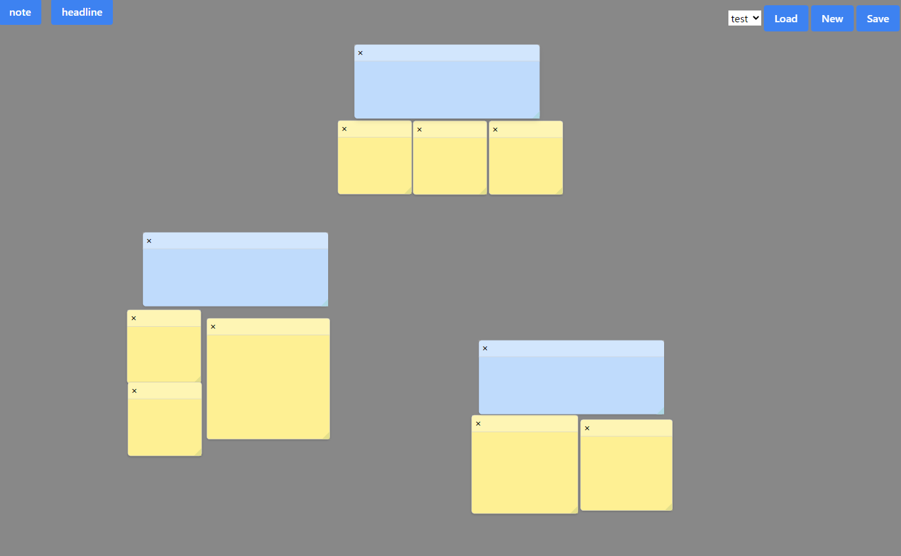

# Sticky Note

This sticky note project was created in Tauri for the author's TypeScript and Rust study.



## Features

- Create, edit, and delete sticky notes.
- Sticky notes can be re-sized, rearranged and memorized their positions.
- It has headlines and can name sticky note groups.


## Development Usage

To get started with  Sticky Note, follow these steps:

1. Install dependencies:
    ```bash
    npm install
    ```
2. Start Sticky Note:
    ```bash
    cargo tauri dev --no-watch
    ```


## License

This project is licensed under the MIT License. 


